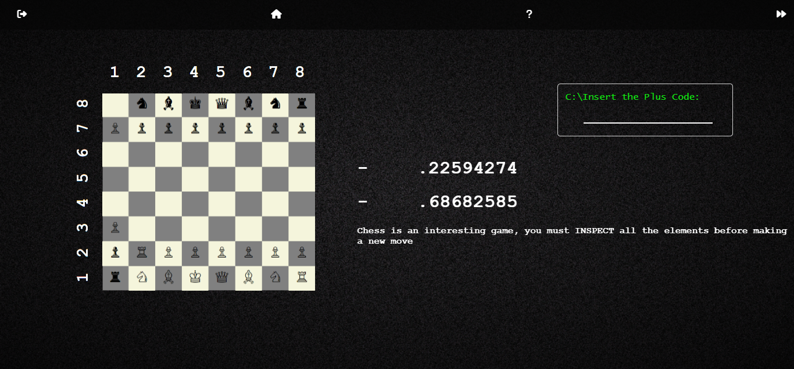

<!DOCTYPE html>
<html lang="pt-br">
<head>
    <meta charset="UTF-8">
    <meta name="viewport" content="width=device-width, initial-scale=1.0">

</head>
<body>
    <h1>Jogo de Quebra-Cabeça Simples</h1>
    

        <h2>Descrição</h2>
        
Este é um jogo de quebra-cabeça simples criado como um projeto escolar. O objetivo do jogo é resolver o quebra-cabeça rearranjando as peças na ordem correta.

    

    

        <h2>Funcionalidades</h2>
        <ul>
            <li>Interface intuitiva e fácil de usar.</li>
            <li>Peças do quebra-cabeça interativas que podem ser arrastadas.</li>
            <li>Verificação automática quando o quebra-cabeça é resolvido.</li>
        </ul>
    

    

        <h2>Como Jogar</h2>
        
Arraste e solte as peças do quebra-cabeça para colocá-las na posição correta. O jogo detecta automaticamente quando todas as peças estão na ordem certa.

        
    

    

        <h2>Instalação e Execução</h2>
        <pre><code>
# Clone este repositório
git clone https://github.com/srdarf/seu-repositorio.git

# Navegue até o diretório do projeto
cd seu-repositorio

# Abra o arquivo HTML no seu navegador
index.html
        </code></pre>
    

    

        <h2>Acesse o Jogo</h2>
        
Você pode jogar o quebra-cabeça online acessando o seguinte link:

        
<a href="https://srdarf.github.io/SURIS/GENERIC%20LOGIN%20THING/index.html" target="_blank">Jogar Quebra-Cabeça</a>

    

    

        <h2>Contribuições</h2>
        
Se você quiser contribuir para este projeto, por favor, envie um pull request ou abra uma issue para discutir melhorias e correções.

    

    

        <h2>Licença</h2>
        
Este projeto está licenciado sob a <a href="https://opensource.org/licenses/MIT" target="_blank">Licença MIT</a>.

    

</body>
</html>
